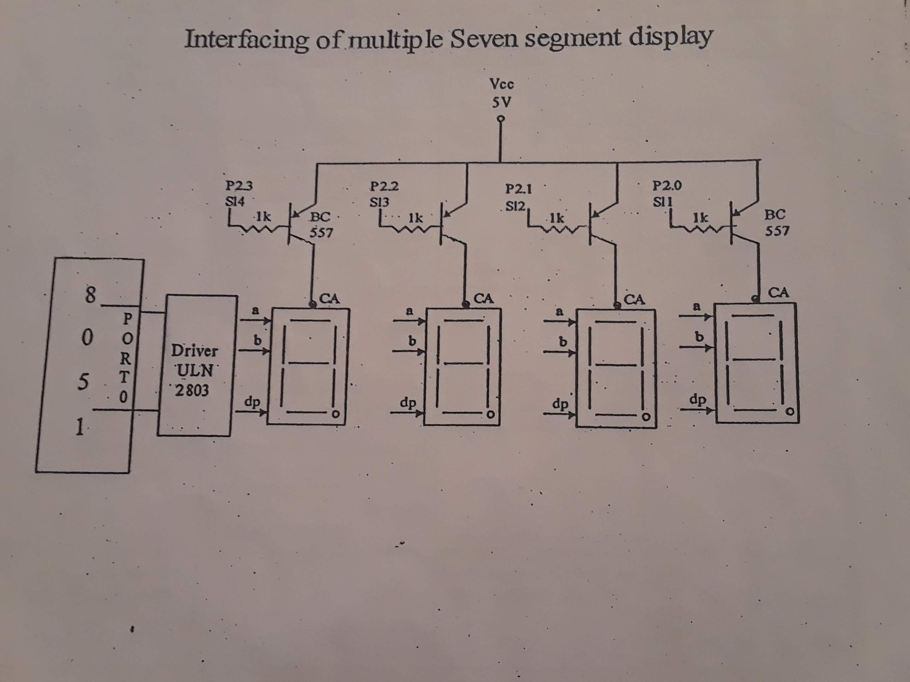
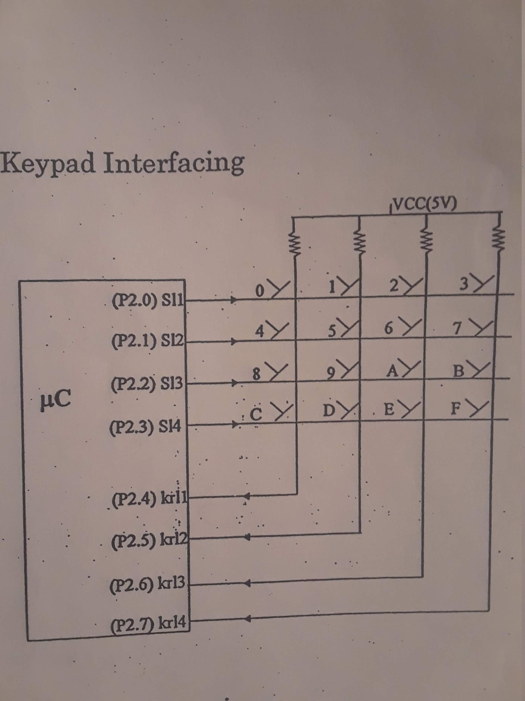
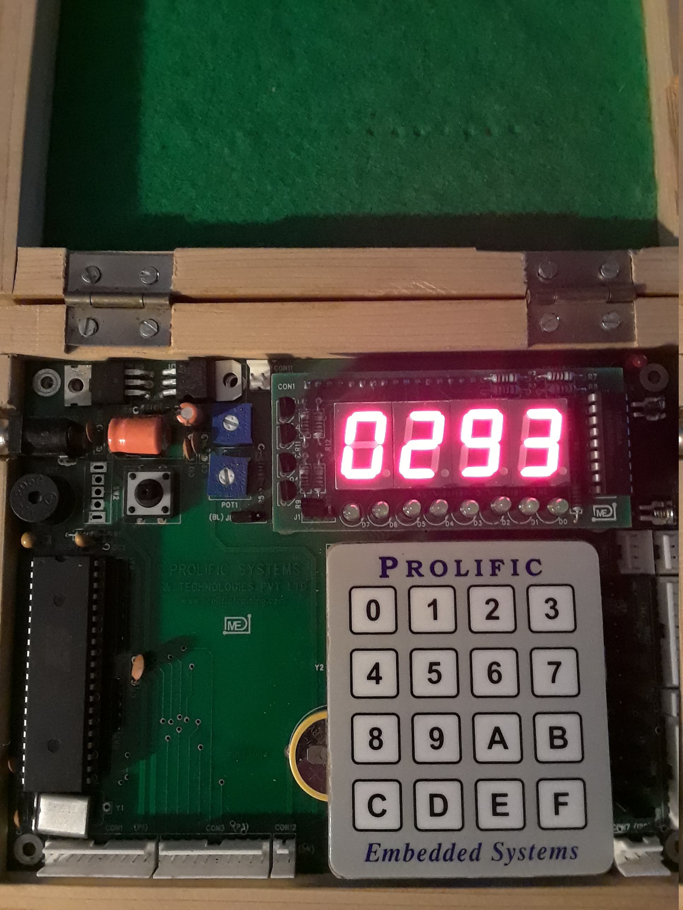

# stopwatch
Stopwatch using keypad and counter

## Getting Started

### Requirements
* Keil IDE
* Flash Magic
* 8051 microcontroller
* Driver ULN 2803
* 7-segment displays (x4)
* Buzzer
* Hex keypad

### Installing
1. Connect 7-segment displays to the 8051 microcontroller as shown in the following diagram:
   
1. Connect hex keypad to the 8051 microcontroller as shown in the following diagram:
   
1. Connect buzzer to P1.5 of the 8051 microcontroller
1. Open Keil and create new project
   * Choose Philips P89V51RD2 database
1. Add stopwatch.c file to Source Group
1. Build target
1. Use Flash Magic to write the resulting hex file to the 8051 microcontroller

### Example

Pushing hex A on the keypad, count starts incrementing. Pushing hex B, count pauses. Pushing hex C stops and resets the count.
Current count shown is 0293.

## Authors

* **Sahil Mahajan**

## License

This project intentionally has no license.

